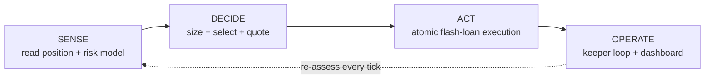

# Liquidation Shield

**A closed-loop control system that protects leveraged Aave v3 positions from liquidation — automatically, atomically, and only when it's economically worth it.**

[](https://www.typescriptlang.org/)
[](https://soliditylang.org/)
[](https://book.getfoundry.sh/)
[](https://nextjs.org/)
[](https://viem.sh/)
[](#testing--verification)
[](./LICENSE)
[](https://liquidation-shield.vercel.app)

Built for **CSI ORIGIN 2026 — Problem Statement 11**.

---

## The problem

On Aave v3, if your Health Factor drops below `1.0`, anyone can liquidate up to 50% of your debt (100% if you're deep underwater or your position is dust) and walk away with a **5–10% bonus** on top, paid out of your collateral. On a $19,000 debt position, that's roughly **$475 gone in a single block** — and your position is still leveraged afterward.

Existing tools *alert* you. None of them *act*. Liquidation Shield closes that gap: it watches your position, forecasts whether it's about to cross the line, sizes the *minimum* possible intervention to pull it back to safety, checks that the intervention actually costs less than the damage it prevents, and executes the whole thing as one atomic, non-custodial transaction — or reverts and changes nothing.

```
10 WETH / $19,000 USDC, HF drifting toward 1.0
        │
        ▼
 do nothing → liquidated → ~$475 gone, still leveraged
        │
        ▼
 Liquidation Shield → release 0.59 WETH, repay $1,743 via flash loan
                    → HF restored to 1.35
                    → user pays $18.50 in friction (99.9% cheaper)
```

## How it works

Four stages, each independently testable:



| Stage | What it does | Where |
|---|---|---|
| **Sense** | Reads a wallet's real Aave v3 position via multicall, cross-checks against `getUserAccountData` to `1e-13` precision, estimates collateral/debt volatility (EWMA), and computes a liquidation probability via the reflection principle for a driftless GBM barrier-hit | [`agent/src/reader`](agent/src/reader), [`agent/src/risk`](agent/src/risk) |
| **Decide** | Solves the minimum collateral release needed to hit a *dynamic* target Health Factor, picks the collateral/debt pair that burns the least capital, quotes the swap, and gates the whole thing on a net-benefit check | [`agent/src/planner`](agent/src/planner) |
| **Act** | A non-custodial Solidity contract that flash-borrows the repayment, repays debt, releases just enough collateral, swaps it back, repays the flash loan, and reverts if any step fails or the resulting Health Factor doesn't meet the target | [`contracts/src`](contracts/src) |
| **Operate** | A keeper loop that ticks on an interval, logs every decision (assess → plan → execute/refuse), and a dashboard that visualizes it live | [`agent/src/keeper-backend`](agent/src/keeper-backend), [`dashboard`](dashboard) |

### The math that makes it "dynamic," not a fixed threshold

**Liquidation probability** — reflection principle for a zero-drift GBM collateral/debt exchange rate hitting a barrier at `HF = 1`:

```
P_liq(T) = 2 · Φ( −ln(HF) / (σ√T) )
```

**Target Health Factor** — widens with volatility and the worst-case time until the next intervention window, never a hardcoded constant:

```
Hₜ = 1 + max( floorBuffer, z·σ·√Δt_react ) · μ
```

**Minimum intervention size** — solving the circular dependency between how much collateral to release (`V`) and the execution friction (`κ`) that releasing it costs:

```
V_min = (Hₜ·D − A) / (Hₜ·(1−κⱼ) − LTⱼ)      subject to   Hₜ(1−κⱼ) > LTⱼ
```

Collateral selection is `argmin_j V_j·κ_j` — not "release the lowest-LT asset," which picks wrong (a low-LT asset needing less `V` released is often the more illiquid one with higher slippage).

## Quick start

```bash
git clone https://github.com/Pragatish616/liquidation-shield.git
cd liquidation-shield
pnpm install
cp .env.example .env   # add your own Alchemy/Infura mainnet RPC URL

# terminal 1 — bring up a pinned mainnet fork
pnpm fork

# terminal 2
pnpm seed                          # seed a controllable WETH/USDC position
pnpm assess <address>              # Sense: full risk report, <2s
pnpm plan                          # Decide: ranked intervention candidates
pnpm crash --asset WETH --pct -12  # simulate a price crash
pnpm demo:real                     # Sense → Decide → Act, end-to-end, on real data

pnpm server                        # Operate: keeper HTTP server at localhost:8080

cd dashboard && pnpm install && pnpm dev   # visualize it at localhost:3000
```

## Project structure

```
liquidation-shield/
├─ agent/src/
│  ├─ reader/          Sense — multicall position reader, e-mode/isolation refusal
│  ├─ risk/             Sense — EWMA volatility, hitting probability, dynamic buffer
│  ├─ planner/          Decide — sizing, selection, quoting, viability gate
│  └─ keeper-backend/   Operate — keeper loop, decision log, real-data bridge
├─ contracts/src/       Act — LiquidationShield.sol, PolicyRegistry.sol (Foundry)
├─ scripts/             fork setup, position seeding, price-crash tooling, demos
├─ dashboard/           Operate — Next.js control-center UI
└─ data/prices/         cached historical price series for the volatility model
```

## Testing & verification

Every number this system produces traces back to a passing test — not a demo that only looks right.

- **HF equality**: local computation vs. Aave's own `getUserAccountData`, on real mainnet borrowers, on a pinned fork — off by `3×10⁻¹³` to `9×10⁻¹⁶`, six-plus orders of magnitude inside the required tolerance.
- **Liquidation probability**: reproduces the exact published fixture table for the reflection-principle formula.
- **E-mode / isolation-mode positions**: explicitly detected and refused rather than silently mispriced.
- **Minimum-intervention sizing**: reproduces the canonical worked example (10 WETH / $19k USDC → release 0.5873 WETH, repay $1,743.36, burn $18.50) to the cent.
- **147 tests passing** across the TypeScript agent (vitest) and the keeper backend (Node's native test runner); Foundry contracts compile clean.

```bash
pnpm test              # agent + planner (vitest)
pnpm test:keeper        # keeper-backend (node --test)
cd contracts && forge build && forge test
```

## Tech stack

**Chain interaction** — [viem](https://viem.sh/), [`@bgd-labs/aave-address-book`](https://github.com/aave-dao/aave-address-book) for canonical contract addresses (never hand-typed), [Foundry](https://book.getfoundry.sh/) for the fork harness and contracts.

**Contracts** — Solidity 0.8.24, OpenZeppelin, non-custodial by design (the shield never holds user funds — it operates on a revocable aToken approval and an on-chain policy).

**Off-chain agent** — TypeScript, vitest, zod-validated config.

**Dashboard** — Next.js 14 (App Router), Tailwind CSS, Geist Sans/Mono, Phosphor Icons, Motion — reads the live decision log produced by the real agent, either from a local file or a deployed backend.

## Deploying

- **Dashboard → Vercel**: import this repo, set the project's **Root Directory to `dashboard`**. Optionally set `BACKEND_URL` to point it at a deployed backend.
- **Keeper backend → Render** (or any Node host): `pnpm server` starts an HTTP server (`agent/src/keeper-backend/src/server.ts`) that runs the same assess → plan → execute/refuse pipeline on a timer and exposes it at `GET /api/decisions`. A `render.yaml` blueprint is included at the repo root. Real on-chain mode activates automatically when `WATCH_ADDRESS`, `MAINNET_RPC`, and `FORK_BLOCK` are set and an Anvil fork is reachable; otherwise it runs a continuously-ticking simulated market so the deployed backend is always genuinely live.

## Non-custodial by design

The shield never takes custody of user funds. A user grants exactly two revocable things: an aToken approval capped at a maximum releasable amount, and a policy entry (trigger HF, target HF, max cost, allowed collaterals, expiry). The blast radius of anything going wrong is bounded by that approval — the same pattern Aave's own debt-swap adapters use.

## Team

| | |
|---|---|
| **Pragatish** | [@Pragatish616](https://github.com/Pragatish616) |
| **Vijayaraghavan M** | [@luckynest7-beep](https://github.com/luckynest7-beep) |
| **Gokul Nath S** | [@Gokulnath-AI](https://github.com/Gokulnath-AI) |
| **Ravi R Kamath** | [@ravi-kamath07](https://github.com/ravi-kamath07) |

## License

MIT — see [LICENSE](./LICENSE). Copyright © 2026 the Liquidation Shield team.
